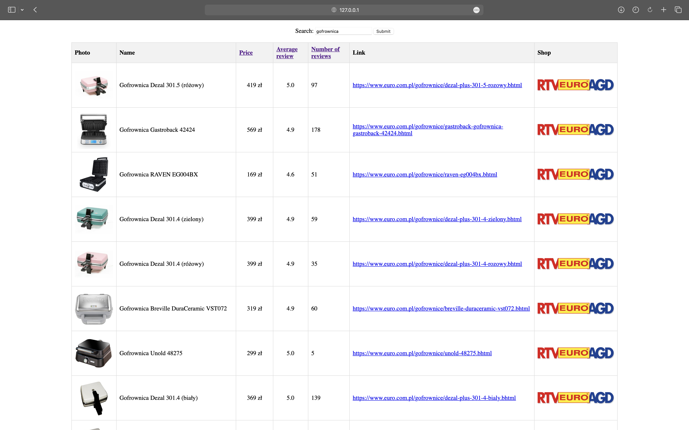

# RTV Stores Web Scraper



## Overview

RTV Stores Web Scraper is a Django-based web application that allows users to search for electronic products across various Polish RTV (Radio, Television, and Electronics) stores. The application uses Selenium for web scraping to fetch product information from supported stores.

## Features

- **Search Functionality:** Users can search for a specific product (e.g., Toaster) to get detailed information from multiple RTV stores. Currently, the application supports the following stores:
  - [RTV Euro AGD](https://www.euro.com.pl/)
  - [Neonet](https://www.neonet.pl/) 🚧 WIP 🚧
  - [Media Expert](https://www.mediaexpert.pl/) 🚧 WIP 🚧

- **Sortable Results:** Users can sort the search results in both ascending and descending order based on price, product rating, and the number of ratings.

- **Product Information:** The app provides comprehensive information for each product, including names, prices, photos, links to the product pages, average rating, and the number of ratings.

## Usage

1. **Search:** Enter the desired product in the search bar on the home page and click the search button.

2. **Sort Results:** Use the sorting options to arrange the search results based on price, rating, or the number of ratings.

3. **View Details:** Click on a specific product to view detailed information, including photos, links, and user ratings.

## Installation

```bash
# Clone the repository
git clone https://github.com/yourusername/rtv-stores-web-scraper.git

# Navigate to the project directory
cd rtv-stores-web-scraper

# Install dependencies
pip install -r requirements.txt

# Run database migrations
python manage.py migrate

# Run the Django development server
python manage.py runserver
```

Visit `http://localhost:8000/` in your web browser to access the application.